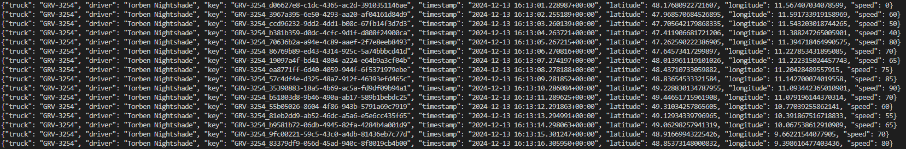

# Kafka-real-time-tracking

This project is about real-time tracking of vehicle location with Kafka. It simulates a data stream with incoming coordinates and the respective speed of a certain truck. The real time location of the truck is displayed on an interactive map where the location gets updated every second a new coordinates and its speed comes in. The map is provided by an API of Mapbox. This whole project run as a flask application.

The project consists of the following files:

1. The main _app.py_ firstly starts subsequently 5 threads to run kafka zookeeper, server, creating a topic, producer and consumer. It creates a new topic for every session to avoid crashing. Kafka is set to run on port 9092. After successfully starting kafka the file starts the simulating data stream in _truck1.py_. The project can easily get augmented by several trucks. Just create truck files for every vehicle.

2. _truck1.py_: This file sends the coordinates and speed of a truck every second simulating the data stream. It uses data from _truck1.json_.

3. _index.html_: This file integrate a Mapbox map with the real-time tracking to visualize it in a browser. 

4. _truck1.json_: This file contains the coordinates and speed of a certain truck, its driver and its plate number. The coordinates are the result of the project _AI-Route-Optimization-Assistant_.

## Getting started

To set up this repo create a folder for the project on your system (instructions for windows), open a terminal window, write "cd" and paste the folder path cd "C:\Users\user\path\to\your\folder". Then type `git clone https://github.com/Yesitin/Website-with-Chatbot-and-Interactive-Dashboard.git` to download the whole repository. Ensure that you have installed python and git. Furthermore, it's crucial to install Kafka and set global system environment variables such that Kafka can be called like `C:\kafka`.

Next, create a virtual environment in order to avoid dependency conflicts. For this, type into the terminal python -m venv env. With `env\Scripts\activate` you start the environment.

Now you can install all dependencies with `pip install -r requirements.txt`. 

Finally, run the main file _app.py_. It will take a few seconds until kafka set up. Look out for the following section or enter after some time into your browsers search bar `http://127.0.0.1:5001/` to start the visulization and its data stream.

## Use example

GIF animation to briefly showcase the datastream:

Mapbox map:

Coordinates data stream:

